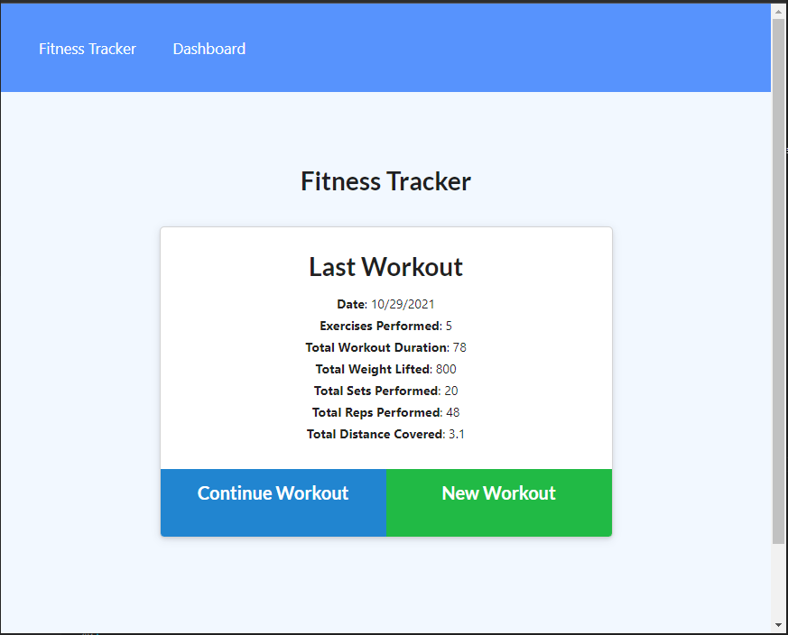
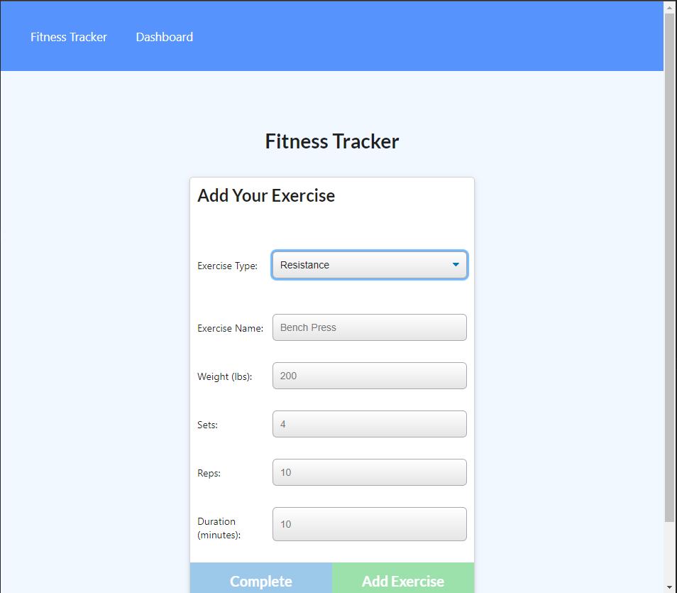
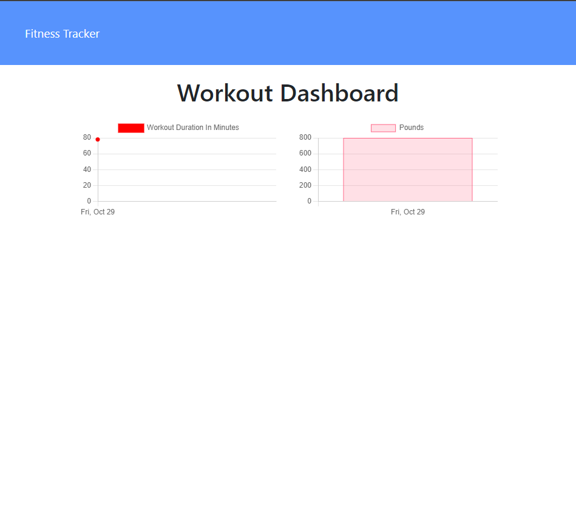

# WorkoutTracker

## Table of Contents
* [Description](#description)
* [Installation](#installation)
* [Usage](#usage)
  * [License](#license) 
* [Contributing](#contributing)
* [Tests](#tests)
* [Questions](#questions)

----

## Description
This project was assigned as prt of the GTPE Coding Bootcamp to create a NOSQL based workout tracker which allows users to record daily workouts and displays the past weeks stats in a Dashboard.

----

## Installation
No installation needed for this project.

----

## Usage
To use this app, follow the link provided to the live project.

Use the create workout button to create a new workout tracker.

Use the continue workout button to move to the exercise screen to add exercises to the workout.
* exercises can be resistance or cardio

Use the dashboard button to view your workout stats

[Go To Live Project](https://workout87.herokuapp.com/)

[Project Repo](https://github.com/BerlicTheHunter/WorkoutTracker)

## License
This project is licensed under MIT License and can be found [here](./LICENSE)

----

## Contributing
This project is not accepting contributions at this time

----

## Tests
None provided

----

## Questions
For any other questions, please the the provided links below
* [Github](https://github.com/BerlicTheHunter)
* [Email](mailto:bsorrell3@gmail.com)

